# BOUNDED CONTEXTS — Context Map

**Data:** 22/08/2026 · **Fase:** Prompt 01, STEP 6
**Base:** 40 modelos de `schema.prisma` e 17 módulos de `apps/api/src` — contextos **derivados do código real**, não propostos de fora

---

## 1. Context map

```mermaid
graph TB
    subgraph Plataforma
        IAM[Identity & Access<br/>User · Tenant · Membership<br/>auth · account · team · admin]
        PLAN[Plans & Billing<br/>Plan · Subscription · PlanUsage<br/>billing · entitlements]
        TAX[Taxonomy<br/>Segment · SegmentLocale<br/>segments · GLOBAL]
        SYS[Platform Services<br/>Notification · AuditLog · ExportJob<br/>notifications · system]
    end

    subgraph Comercial
        CRM[Lead / CRM<br/>Lead · DigitalPresence · Score<br/>leads]
        PIPE[Pipeline<br/>Stage · Card · Transition<br/>pipeline]
        OUT[Outreach<br/>OutreachMessage<br/>outreach]
        DOC[Commercial Docs<br/>Proposal · Contract<br/>proposals]
    end

    subgraph Aquisição
        ACQ[Prospecting<br/>Search · ScrapeJob · SourceRecord<br/>prospecting]
        INT[Intelligence<br/>TARGET — não existe]
    end

    IAM --> PLAN
    PLAN -.entitlement.-> ACQ
    PLAN -.entitlement.-> INT
    ACQ --> CRM
    INT --> CRM
    TAX -.catálogo.-> ACQ
    CRM --> PIPE
    CRM --> OUT
    PIPE --> DOC
    SYS -.transversal.-> CRM

    style INT stroke-dasharray: 5 5
```



**Regra de direção, inegociável:** Aquisição e Intelligence conhecem o CRM. **O CRM não conhece nem Aquisição nem Intelligence.** É o que permite `INTELLIGENCE_DISABLED` funcionar de verdade.

---

## 2. Os contextos

### 2.1 Identity & Access · `CURRENT`

`User`, `Tenant`, `Membership`, `Invitation`, `RefreshToken`, `PlatformAdmin`
Módulos: `auth`, `account`, `team`, `admin`

Dono da identidade e do `TenantContext`. **Todo outro contexto depende dele e nenhum o modifica.**

### 2.2 Plans & Billing · `CURRENT`

`Plan`, `Subscription`, `PlanUsage`, `Invoice`, `BillingEvent`, `FeatureFlag`, `AppSetting`
Módulos: `billing`, `entitlements`

Responde *"pode usar?"* e *"quanto já usou?"*. É o guardião de entitlement, quota e flag.

**Gap conhecido (G6):** conta unidades, não moeda. O `CostGuard` do Prompt 02 §25 precisa de um campo de custo que não existe.

**Decisão pendente registrada:** `lacunas-estruturais.md` §11.1 determina que *"plano precisa deixar de ser enum"*. Afeta este contexto e deve ser resolvido aqui, não no Intelligence.

### 2.3 Taxonomy · `CURRENT` · particular

`Segment`, `SegmentLocale` — módulo `segments`

**Único contexto sem `tenantId`, e corretamente.** É catálogo global compartilhado, com a decisão de `lacunas-estruturais.md` §8.3: *"importar tudo, tratar como padrão editável"*.

Consumido pela Aquisição para traduzir nicho em termo de busca por localidade.

### 2.4 Prospecting / Acquisition · `CURRENT` → evolui

`ProspectingSearch`, `ScrapeJob`, `LeadSourceRecord` — módulo `prospecting`

**O contexto mais afetado por este programa.** Hoje: um provider, chamado direto. Alvo: o mesmo pipeline atrás de um contrato, com o scraper virando `MapsAdapter`.

Ver ADR-002 e o §7 deste documento.

### 2.5 Lead / CRM · `CURRENT` · núcleo do produto

`Lead`, `LeadDigitalPresence`, `LeadScore`, `LeadScoreReason`, `LeadActivity`, `LeadNote`, `LeadContactRecord`, `LeadFollowUp`, `Tag`, `LeadTag`, `SuppressionEntry`
Módulo: `leads`

**Não pode importar nada de Aquisição, Intelligence ou provider.** Recebe leads por um contrato de entrada; não sabe de onde vieram.

`LeadDigitalPresence` é o ponto de entrada dos sinais enriquecidos — e é onde a auditoria da v0.2 vai escrever.

### 2.6 Pipeline · `CURRENT`

`PipelineStage`, `PipelineCard`, `PipelineTransition` — módulo `pipeline`

Gestão do funil. Depende do CRM, e nada depende dele exceto documentos comerciais.

### 2.7 Outreach · `CURRENT`

`OutreachMessage` — módulo `outreach`

### 2.8 Commercial Documents · `CURRENT` · parcial

`Proposal`, `ProposalItem`, `Contract` — módulo `proposals`

Tabelas existem; a interface fica para a v0.2 conforme `CLAUDE.md`. **Menu com item que só abre paywall é o defeito que o produto existe para evitar** — por isso não está na sidebar.

### 2.9 Platform Services · `CURRENT` · transversal

`Notification`, `AuditLog`, `ExportJob`, `OnboardingState`
Módulos: `notifications`, `system`, `dashboard`

`AuditLog` é o único modelo com `tenantId` **opcional** — correto, porque registra também ações de plataforma sem tenant.

### 2.10 Intelligence · `TARGET`

Não existe. Sua criação é o objeto deste programa.

Sub-áreas previstas:

| Sub-área | Conteúdo |
|---|---|
| **Core** | Run, máquina de estados, tenant, idempotência, eventos |
| **Acquisition** | Registry, Router, Selection Policy, Health, CostGuard |
| **Adapters** | `MapsAdapter` (existente, encapsulado), `SiteAuditAdapter` (v0.2), `FlowsintAdapter` (previsto, não implementado) |
| **Evidence** | Snapshot, normalização, lineage |

---

## 3. Contratos entre contextos

| De | Para | Contrato | Estado |
|---|---|---|---|
| Plans | Intelligence | `EntitlementsService.can(capability)` | `CURRENT` — reutilizar |
| Plans | Intelligence | `CostGuard.check(estimate)` | `TARGET` — depende de G6 |
| Intelligence | CRM | `LeadIngestionPort` — recebe lead normalizado | `TARGET` |
| Intelligence | CRM | `DigitalPresencePort` — grava sinais com evidência | `TARGET` |
| Taxonomy | Intelligence | `SegmentLocale` como termo de busca | `CURRENT` |
| IAM | todos | `TenantContext` | `CURRENT` |

**Todo contrato é unidirecional.** Nenhum contexto comercial expõe interface para o Intelligence chamar de volta.

---

## 4. Fitness functions

Verificações automatizáveis que impedem erosão. Devem entrar no CI.

| # | Regra | Como verificar |
|---|---|---|
| F1 | `leads/` não importa de `prospecting/` nem `intelligence/` | análise estática de imports |
| F2 | `web/` não importa adapter nem tipo de provider | idem |
| F3 | Nenhum módulo importa tipo do Flowsint ou de SDK de provider | idem |
| F4 | Todo repositório que acessa modelo tenant-aware recebe `tenantId` | lint rule ou revisão de assinatura |
| F5 | Nenhum payload bruto de provider entra em modelo de domínio | snapshot precede normalização |
| F6 | Seleção de provider só pelo Router | nenhuma chamada direta a adapter fora dele |
| F7 | Produto funciona com `INTELLIGENCE_DISABLED` | teste E2E dedicado |
| F8 | Sem dependência circular entre contextos | grafo de imports |

**F7 é o mais importante** e deve ser teste, não intenção — é ele que protege o produto atual durante todo o programa.

---

## 5. Decisão de estrutura

`TARGET` — formalizada no ADR-001

Modular monolith. **Não microserviços.**

```text
apps/api/src/
  intelligence/
    core/          run, state machine, tenant, idempotência
    acquisition/   registry, router, policy, health, cost guard
    adapters/
      maps/        encapsula o scraper atual
      site-audit/  v0.2
    evidence/      snapshot, normalização, lineage
```

Justificativa pelo Prompt 01 §47 e §48: um operador, orçamento de complexidade pequeno, e nenhum requisito de escala independente entre módulos. Separação física de serviço não tem problema real a resolver aqui.

---

## 6. Como o `prospecting` evolui

O ponto que mais importa para o roadmap:

```text
HOJE
prospecting/ ──► scraper (chamada direta, provider único)

ALVO
prospecting/ ──► intelligence/acquisition/Router ──► adapters/maps/ ──► scraper
                                                 └─► adapters/site-audit/
```

**Não é reescrita.** O `prospecting` continua dono de `ProspectingSearch` e da intenção de busca. O que muda é que a execução passa a atravessar o Router.

O `ScrapeJob` é o candidato natural a evoluir para `IntelligenceRun` — já tem estado, idempotência, tentativas e duração. Duas alternativas a decidir no STEP 9: estender o modelo existente, ou criar o novo e migrar. **A primeira é mais barata e menos arriscada**, e deve ser a escolha default salvo evidência contrária.
