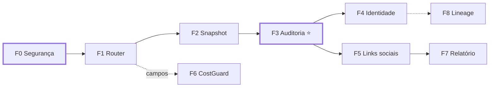

# IMPLEMENTATION ROADMAP

**Data:** 22/08/2026 · **Fase:** Prompt 01, STEP 17
**Ordenação:** por dependência. **Sem datas** — o §43 do Prompt 01 as proíbe, e com um operador elas seriam ficção.

---

## 1. Princípio de ordenação

Três regras que produziram esta sequência:

1. **Segurança antes de coleta.** Nada que busque URL externa entra antes da egress policy.
2. **Fatia vertical antes de camada horizontal.** Uma capability ponta a ponta prova a arquitetura; uma camada completa só revela erros no fim.
3. **Componente sem consumidor não é construído.** Cada item abaixo tem um consumidor nomeado.

---

## 2. Sequência

### F0 — Fundação de segurança e baseline

**Consumidor:** todas as fases seguintes
**Esforço:** P

| Item | Origem |
|---|---|
| Egress policy: validação pós-DNS, revalidação de redirect, limite por streaming | `SECURITY-EGRESS-POLICY.md` §2 |
| Testes S1–S5 (SSRF) | idem §5 |
| Isolamento de rede do worker de coleta | idem §2.5 |
| Baseline de testes registrado — `lint`, `typecheck`, `test`, `build` | W3 do baseline |
| Teste `INTELLIGENCE_DISABLED` no CI | fitness function F7 |

**Pronto quando:** os cinco testes de SSRF passam e existe linha de base de testes documentada.

> **Nada abaixo começa antes de F0 fechar.** É a fase mais curta e a única que protege as outras.

---

### F1 — Contrato e Router com um provider

**Consumidor:** o próprio `prospecting`, que passa a rotear
**Esforço:** M

| Item | Origem |
|---|---|
| `IntelligenceProvider` e `ProviderAdapter` | `PROVIDER-CONTRACT.md` §3 |
| `ProviderRegistry` — substitui o enum `LeadSource` | gap G1 |
| `ProviderRouter` com decisão auditável | §9 |
| `MapsAdapter` encapsulando o scraper atual | `BOUNDED-CONTEXTS.md` §6 |
| Mock provider para provar o Router | D10 |
| `ScrapeJob` estendido com `capability`, `providerId`, `adapterVersion` | D3 |

**Pronto quando:** a busca atual funciona atravessando o Router, sem mudança visível para o usuário, e o mock prova a seleção.

**Risco:** é refatoração de caminho que já funciona. Mitigação: o comportamento externo não muda e a suíte atual é o teste de regressão.

---

### F2 — Snapshot, validação e normalização

**Consumidor:** F3
**Esforço:** M

| Item | Origem |
|---|---|
| `RawSnapshot` — evolução do `LeadSourceRecord` com `contentHash`, `schemaVersion`, `retentionUntil` | G5, risco de retenção |
| Validação de contrato: `VALID` / `INVALID` / `SCHEMA_DRIFT` | Prompt 02 §35 |
| Quarentena — drift não contamina o store normalizado | Prompt 02 §37 |
| Política de retenção do payload | `DATA-OWNERSHIP.md` §5 |

**Pronto quando:** payload malformado vai para quarentena e não aparece em dado normalizado, provado por teste.

---

### F3 — Auditoria de site como segundo provider ⭐

**Consumidor:** a v0.2 aprovada — Fases 1 e 2 do `scope-v0.2.md`
**Esforço:** G

| Item | Origem |
|---|---|
| `NativeSiteAuditor` — DNS, HTTP, HTTPS, redirect, viewport, TTFB, meta | `scope-v0.2.md` §3.1 |
| Capability `WEBSITE_HEALTH_AUDIT` | `PROVIDER-CONTRACT.md` §2 |
| Nove categorias de classificação | `scope-v0.2.md` §3.4 |
| `DigitalPresenceAudit`, `DigitalPresenceCheck` | idem §5 |
| `DigitalPresencePort` com evidência obrigatória | `DATA-OWNERSHIP.md` §3 |

**Pronto quando:** um lead auditado produz medições persistidas com evidência e data, e a categoria alimenta o score sem quebrá-lo.

> **Esta é a fase que prova a arquitetura.** Segundo provider real, atravessando Router, produzindo evidência, entregando feature aprovada. Se algo estiver errado no desenho, aparece aqui.

---

### F4 — Identidade canônica

**Consumidor:** disparado pela existência do segundo provider em F3
**Esforço:** M

| Item | Origem |
|---|---|
| `ExternalReference` — `placeId` e `cid` saem das colunas do `Lead` | gap G3 |
| `CanonicalIdentity` explícita | Prompt 02 §33 |
| Migração dos dados existentes | — |

**Por que aqui e não antes:** com um provider, `fingerprint` resolve. O gap vence quando o segundo chega — não antes.

---

### F5 — Links sociais do site

**Consumidor:** v0.2 Fase 3
**Esforço:** P

| Item | Origem |
|---|---|
| Capability `SOCIAL_LINK_DISCOVERY` | medido: 69% de cobertura |
| `PRESENTE` só com URL como evidência | `scope-v0.2.md` §3.2 |
| O resto permanece `DESCONHECIDO` | regra 4 do `CLAUDE.md` |

**Esforço pequeno porque a mecânica já foi medida no Gate 0** — extração de link do HTML, sem heurística.

---

### F6 — Custo e CostGuard

**Consumidor:** o primeiro provider pago
**Esforço:** M

| Item | Origem |
|---|---|
| `UsageEvent` com custo em centavos | gap G6 |
| `CostGuard`: `ALLOW` / `ALLOW_CHEAPER` / `BLOCK` | Prompt 02 §25 |
| Alerta de custo diário | — |

**Gatilho:** antes de qualquer provider que cobre por chamada. Enquanto tudo for nativo, o custo é infraestrutura.

**Exceção:** os **campos** de custo nascem em F1, com o modelo. Só a lógica de guarda espera.

---

### F7 — Relatório e comercialização da v0.2

**Consumidor:** a agência que compra
**Esforço:** G

| Item | Origem |
|---|---|
| Relatório PDF com marca da agência | `scope-v0.2.md` §4 |
| Link público com validade | idem |
| Entitlements `audit.run` e `audit.export` | idem §6 |
| Contagem em `PlanUsage`, gate na tentativa | idem |

**Pronto quando:** uma agência gera e envia um relatório, sem nenhum número inventado.

---

### F8 — Lineage estruturado

**Consumidor:** quando duas fontes divergirem sobre o mesmo campo
**Esforço:** M

`LeadScoreReason.evidence` deixa de ser `String?` livre. **Adiar até existir a divergência** — antes disso, é estrutura sem uso.

---

## 3. O que fica fora, e por quê

| Item | Motivo |
|---|---|
| Flowsint | ADR-002 |
| Neo4j / grafo | ADR-003 |
| IA de análise | Ambos os prompts proíbem; `scope-v0.2.md` §7 exclui do relatório |
| Signal Engine | Exige histórico temporal que não existe |
| Entity resolution probabilística | `fingerprint` resolve na escala atual |
| Ads Intelligence | Sem fonte legítima no Brasil |
| Descoberta social por nome | Login wall, e já fora de escopo desde 06/08 |
| Fila ou observabilidade nova | BullMQ e logs atendem |

---

## 4. Dependências



**Caminho crítico até valor comercial:** F0 → F1 → F2 → F3 → F5 → F7.

F4, F6 e F8 são disparados por gatilho, não por posição na fila.

---

## 5. Correção do roadmap do Prompt 02

O §96 do Prompt 02 propõe:

```text
03A Flowsint Source/License Audit
03B Flowsint Runtime Isolation
03C Flowsint Provider Adapter
03D Flowsint Contract + Router Integration
```

**As quatro subfases deixam de existir** pelo ADR-002. O 03A foi absorvido pelo STEP 4 deste Prompt 01 — licença verificada, versão pinada, decisão registrada.

O que resta do Prompt 02 permanece válido: Provider Contract, Registry, Router, Selection Policy, Health, Snapshot, Normalização, Evidence, Schema Drift e Quarentena — todos presentes em F1, F2 e F3, com providers reais em vez de mocks.

---

## 6. Riscos

| Risco | Gatilho | Mitigação |
|---|---|---|
| SSRF na primeira coleta | Início de F3 sem F0 | F0 é bloqueante |
| Refatoração de F1 quebrar a busca atual | Regressão na suíte | Comportamento externo inalterado + suíte como gate |
| Foundation virar overengineering | Componente sem consumidor | Cada fase nomeia o seu |
| `payload` crescer sem limite | Já ocorre | Política de retenção em F2 |
| Margem negativa | Primeiro provider pago sem F6 | Gatilho explícito |
| Escopo maior que a capacidade | F1+F2+F3 passarem de expectativa | Cortar F8, F6 e adiar F4 |

---

## 7. Próximo prompt

Não é o Prompt 02 como está escrito — ele pressupõe Flowsint e mocks.

**Recomendação:** um Prompt 02 revisado cobrindo **F0 e F1**, com o `MapsAdapter` real em vez de mock. O provider real já existe e funciona; usá-lo prova mais que um mock, e evita construir duas vezes.
